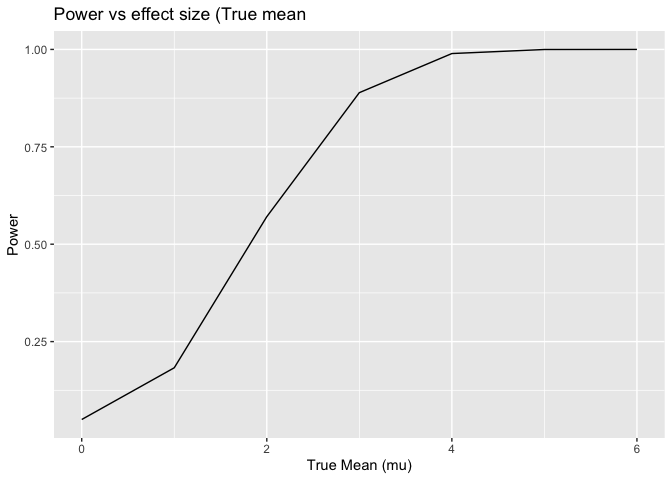
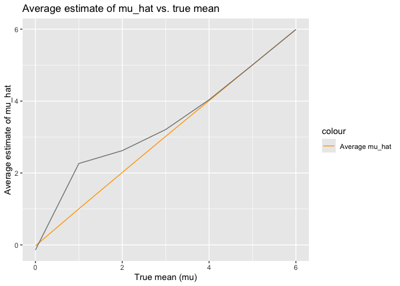
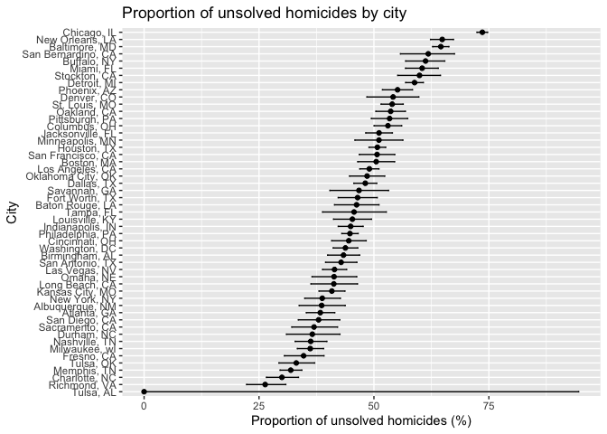
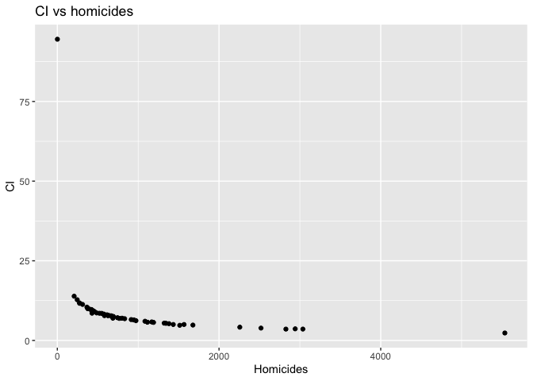

p8105_hw5_lah2231
================
2024-11-12

``` r
library(tidyverse)
```

    ## ── Attaching core tidyverse packages ──────────────────────── tidyverse 2.0.0 ──
    ## ✔ dplyr     1.1.4     ✔ readr     2.1.5
    ## ✔ forcats   1.0.0     ✔ stringr   1.5.1
    ## ✔ ggplot2   3.5.1     ✔ tibble    3.2.1
    ## ✔ lubridate 1.9.3     ✔ tidyr     1.3.1
    ## ✔ purrr     1.0.2     
    ## ── Conflicts ────────────────────────────────────────── tidyverse_conflicts() ──
    ## ✖ dplyr::filter() masks stats::filter()
    ## ✖ dplyr::lag()    masks stats::lag()
    ## ℹ Use the conflicted package (<http://conflicted.r-lib.org/>) to force all conflicts to become errors

``` r
library(broom)
library(ggplot2)
library(dplyr)
library(purrr)
```

# Problem 2

## T-Test simulation function

``` r
n <- 30
sigma <- 5
mu_values <- c(0, 1, 2, 3, 4, 5, 6)
num_simulations <- 5000
alpha <- 0.05

simulate_t_test <- function(mu) {
  sample_data <- rnorm(n, mean = mu, sd = sigma)
  
  test_result <- t.test(sample_data, mu = 0)
  
  result <- tidy(test_result) %>% 
    select(estimate, p.value)
  
  result
}
```

## Running Simulation

``` r
simulation_results <- expand_grid(mu = mu_values, sim = 1:num_simulations) |>
  mutate(result = map(mu, simulate_t_test)) |>
  unnest(result)
```

## Calculating Power

``` r
power_results <- simulation_results %>%
  group_by(mu) %>%
  summarize(power = mean(p.value < alpha))
```

## Plotting Power

``` r
power_results %>%
  ggplot(aes(x = mu, y = power)) +
  geom_line() +
  labs(x = "True Mean (mu)", y = "Power", title = "Power vs. Effect Size (True Mean)")
```

<!-- -->
\## Calculating averga Eestimate of mu_hat

``` r
average_mu_hat <- simulation_results %>%
  group_by(mu) %>%
  summarize(
    avg_mu_hat = mean(estimate),
    avg_mu_hat_rejected = mean(estimate[p.value < alpha])
  )
```

## Plotting average estimate of mu_hat vs. true mean

``` r
average_mu_hat %>%
  ggplot(aes(x = mu)) +
  geom_line(aes(y = avg_mu_hat, color = "Average mu_hat")) +
  geom_line(aes(y = avg_mu_hat_rejected, color = "Average mu_hat (Rejected)")) +
  labs(x = "True mean (mu)", y = "Average estimate of mu_hat",
       title = "Average estimate of mu_hat vs. true mean") +
  scale_color_manual(values = c("Average mu_hat" = "blue", "Average mu_hat (Rejected)" = "red"))
```

<!-- -->

# Problem 3

## Loading Data Homicides

``` r
library(readr)

url <- "https://raw.githubusercontent.com/washingtonpost/data-homicides/master/homicide-data.csv"

homicide_data <- read_csv(url)
```

    ## Rows: 52179 Columns: 12
    ## ── Column specification ────────────────────────────────────────────────────────
    ## Delimiter: ","
    ## chr (9): uid, victim_last, victim_first, victim_race, victim_age, victim_sex...
    ## dbl (3): reported_date, lat, lon
    ## 
    ## ℹ Use `spec()` to retrieve the full column specification for this data.
    ## ℹ Specify the column types or set `show_col_types = FALSE` to quiet this message.

``` r
head(homicide_data)
```

    ## # A tibble: 6 × 12
    ##   uid   reported_date victim_last victim_first victim_race victim_age victim_sex
    ##   <chr>         <dbl> <chr>       <chr>        <chr>       <chr>      <chr>     
    ## 1 Alb-…      20100504 GARCIA      JUAN         Hispanic    78         Male      
    ## 2 Alb-…      20100216 MONTOYA     CAMERON      Hispanic    17         Male      
    ## 3 Alb-…      20100601 SATTERFIELD VIVIANA      White       15         Female    
    ## 4 Alb-…      20100101 MENDIOLA    CARLOS       Hispanic    32         Male      
    ## 5 Alb-…      20100102 MULA        VIVIAN       White       72         Female    
    ## 6 Alb-…      20100126 BOOK        GERALDINE    White       91         Female    
    ## # ℹ 5 more variables: city <chr>, state <chr>, lat <dbl>, lon <dbl>,
    ## #   disposition <chr>

``` r
dim(homicide_data)
```

    ## [1] 52179    12

``` r
summary(homicide_data)
```

    ##      uid            reported_date       victim_last        victim_first      
    ##  Length:52179       Min.   : 20070101   Length:52179       Length:52179      
    ##  Class :character   1st Qu.: 20100318   Class :character   Class :character  
    ##  Mode  :character   Median : 20121216   Mode  :character   Mode  :character  
    ##                     Mean   : 20130899                                        
    ##                     3rd Qu.: 20150911                                        
    ##                     Max.   :201511105                                        
    ##                                                                              
    ##  victim_race         victim_age         victim_sex            city          
    ##  Length:52179       Length:52179       Length:52179       Length:52179      
    ##  Class :character   Class :character   Class :character   Class :character  
    ##  Mode  :character   Mode  :character   Mode  :character   Mode  :character  
    ##                                                                             
    ##                                                                             
    ##                                                                             
    ##                                                                             
    ##     state                lat             lon          disposition       
    ##  Length:52179       Min.   :25.73   Min.   :-122.51   Length:52179      
    ##  Class :character   1st Qu.:33.77   1st Qu.: -96.00   Class :character  
    ##  Mode  :character   Median :38.52   Median : -87.71   Mode  :character  
    ##                     Mean   :37.03   Mean   : -91.47                     
    ##                     3rd Qu.:40.03   3rd Qu.: -81.76                     
    ##                     Max.   :45.05   Max.   : -71.01                     
    ##                     NA's   :60      NA's   :60

This dataset about homicides in major US cities contains 12 columns and
52179 rows. There are 120 missing values across the dataset. The columns
include: uid, reported_date, victim_last, victim_first, victim_race,
victim_age, victim_sex, city, state, lat, lon, disposition.

## Creating City State Column and finding total and unsolved homicides

``` r
homicide_data <- mutate(homicide_data, city_state = paste(city, state, sep = ", "))

homicide_summary <- homicide_data |>
  group_by(city_state) |>
  summarize(
    total_homicides = n(),
    unsolved_homicides = sum(disposition %in% c("Closed without arrest", "Open/No arrest")),
    .groups = "drop"
  )

head(homicide_summary)
```

    ## # A tibble: 6 × 3
    ##   city_state      total_homicides unsolved_homicides
    ##   <chr>                     <int>              <int>
    ## 1 Albuquerque, NM             378                146
    ## 2 Atlanta, GA                 973                373
    ## 3 Baltimore, MD              2827               1825
    ## 4 Baton Rouge, LA             424                196
    ## 5 Birmingham, AL              800                347
    ## 6 Boston, MA                  614                310

This table summarizes all homicides across the 51 cities, including the
total number of homicides (52179) with 26505 unsolved cases.

## Estimating unsolved cases in Baltimore with confidence interval

``` r
baltimore_data <- homicide_summary %>%
  filter(city_state == "Baltimore, MD")

baltimore_prop_test <- prop.test(
  baltimore_data$unsolved_homicides,
  baltimore_data$total_homicides
)
baltimore_prop_test 
```

    ## 
    ##  1-sample proportions test with continuity correction
    ## 
    ## data:  baltimore_data$unsolved_homicides out of baltimore_data$total_homicides, null probability 0.5
    ## X-squared = 239.01, df = 1, p-value < 2.2e-16
    ## alternative hypothesis: true p is not equal to 0.5
    ## 95 percent confidence interval:
    ##  0.6275625 0.6631599
    ## sample estimates:
    ##         p 
    ## 0.6455607

``` r
library(broom)

baltimore_summary <- broom::tidy(baltimore_prop_test) %>%
  select(estimate, conf.low, conf.high)
baltimore_summary
```

    ## # A tibble: 1 × 3
    ##   estimate conf.low conf.high
    ##      <dbl>    <dbl>     <dbl>
    ## 1    0.646    0.628     0.663

In Baltimore 64.6% of homicides are unsolved with a confidence interval
of 62.8% to 66.3%.

## Proportion tests for each city

``` r
homicide_summary <- homicide_summary %>%
  mutate(
    prop_test = map2(
      unsolved_homicides, 
      total_homicides, 
      ~prop.test(.x, .y)
    )
  )
```

    ## Warning: There was 1 warning in `mutate()`.
    ## ℹ In argument: `prop_test = map2(unsolved_homicides, total_homicides,
    ##   ~prop.test(.x, .y))`.
    ## Caused by warning in `prop.test()`:
    ## ! Chi-squared approximation may be incorrect

## Confidence intervals

``` r
homicide_summary <- homicide_summary %>%
  mutate(
    prop_test_tidy = map(prop_test, tidy),
    estimate = map_dbl(prop_test_tidy, ~.x$estimate * 100),
    conf_low = map_dbl(prop_test_tidy, ~.x$conf.low * 100),
    conf_high = map_dbl(prop_test_tidy, ~.x$conf.high * 100)
  )
```

## Selecting relevant columns

``` r
homicide_summary <- homicide_summary %>%
  select(city_state, total_homicides, unsolved_homicides, estimate, conf_low, conf_high)
```

## Plot Homicide Proportion unsolved

``` r
ggplot(homicide_summary, aes(x = reorder(city_state, estimate), y = estimate)) +
  geom_point() +
  geom_errorbar(aes(ymin = conf_low, ymax = conf_high), width = 0.2) +
  coord_flip() +
  labs(
    x = "City",
    y = "Proportion of unsolved homicides (%)",
    title = "Proportion of unsolved homicides by city"
  )
```

<!-- -->

We can see that the proportion of unsolved homicides across 51 cities
goes from 0% to 94.5%. This very large confidence interval is most
probably due to differences in efficiency regarding case solving between
the cities or due to low homicide counts in case numbers. Tulsa seems to
have had only one (solved) homicide case in our dataset which
contributes to the large confidence interval.

``` r
outliers <- homicide_summary |>
  filter(estimate < 10 | estimate > 90)

outliers
```

    ## # A tibble: 1 × 6
    ##   city_state total_homicides unsolved_homicides estimate conf_low conf_high
    ##   <chr>                <int>              <int>    <dbl>    <dbl>     <dbl>
    ## 1 Tulsa, AL                1                  0        0        0      94.5

``` r
homicide_summary |>
  mutate(ci_width = conf_high - conf_low) |>
  ggplot(aes(x = total_homicides, y = ci_width)) +
  geom_point() +
  labs(x = "Homicides", y = "CI",
       title = "CI vs homicides")
```

<!-- -->
