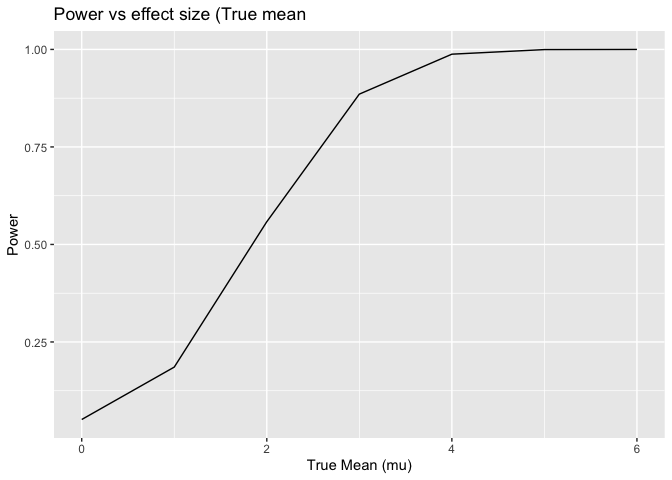

p8105_hw5_lah2231
================
2024-11-12

``` r
library(tidyverse)
```

    ## ── Attaching core tidyverse packages ──────────────────────── tidyverse 2.0.0 ──
    ## ✔ dplyr     1.1.4     ✔ readr     2.1.5
    ## ✔ forcats   1.0.0     ✔ stringr   1.5.1
    ## ✔ ggplot2   3.5.1     ✔ tibble    3.2.1
    ## ✔ lubridate 1.9.3     ✔ tidyr     1.3.1
    ## ✔ purrr     1.0.2     
    ## ── Conflicts ────────────────────────────────────────── tidyverse_conflicts() ──
    ## ✖ dplyr::filter() masks stats::filter()
    ## ✖ dplyr::lag()    masks stats::lag()
    ## ℹ Use the conflicted package (<http://conflicted.r-lib.org/>) to force all conflicts to become errors

``` r
library(broom)
```

# Problem 2

## T-Test simulation function

``` r
n <- 30
sigma <- 5
mu_values <- c(0, 1, 2, 3, 4, 5, 6)
num_simulations <- 5000
alpha <- 0.05

simulate_t_test <- function(mu) {
  # Generate sample data
  sample_data <- rnorm(n, mean = mu, sd = sigma)
  
  # Conduct one-sample t-test against H0: mu = 0
  test_result <- t.test(sample_data, mu = 0)
  
  # Get mean estimate and p-value from the t-test
  result <- tidy(test_result) %>% 
    select(estimate, p.value) # `estimate` should be the correct column name
  
  result
}
```

## Running Simulation

``` r
simulation_results <- expand_grid(mu = mu_values, sim = 1:num_simulations) |>
  mutate(result = map(mu, simulate_t_test)) |>
  unnest(result)
```

## Calculating Power

``` r
power_results <- simulation_results %>%
  group_by(mu) %>%
  summarize(power = mean(p.value < alpha))
```

## Plotting Power

``` r
power_results %>%
  ggplot(aes(x = mu, y = power)) +
  geom_line() +
  labs(x = "True Mean (mu)", y = "Power", title = "Power vs. Effect Size (True Mean)")
```

<!-- -->
\## Calculating Averga Estimate of mu_hat

``` r
average_mu_hat <- simulation_results %>%
  group_by(mu) %>%
  summarize(
    avg_mu_hat = mean(estimate),
    avg_mu_hat_rejected = mean(estimate[p.value < alpha])
  )
```

``` r
average_mu_hat %>%
  ggplot(aes(x = mu)) +
  geom_line(aes(y = avg_mu_hat, color = "Average mu_hat")) +
  geom_line(aes(y = avg_mu_hat_rejected, color = "Average mu_hat (Rejected)")) +
  labs(x = "True mean (mu)", y = "Average estimate of mu_hat",
       title = "Average estimate of mu_hat vs. true mean") +
  scale_color_manual(values = c("Average mu_hat" = "blue", "Average mu_hat (Rejected)" = "red"))
```

<!-- -->
